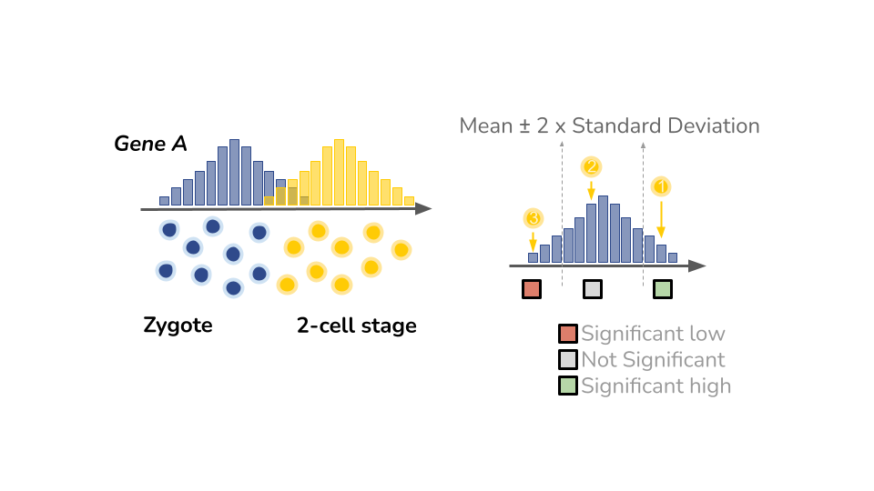
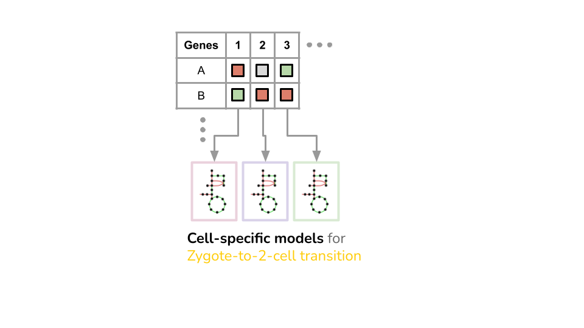

# SCOOTI
`SCOOTI: Single-Cell Optimization Objective and Tradeoff Inference` is a data-driven computational framework to identify cell-specific objectives and trade-offs from transcriptomics data.

- [Overview](#overview)
- [System Requirements](#system-requirements)
- [Identify Metabolic Objectives with Omics Datasets](#identify-metabolic-objective-with-omics-datasets)
  - [Up- and Down-Regulated Genes](#identify-up-and-down-regulated-genes)
  - [Constraint Flux Regulation](#constraint-flux-regulation)
  - [Meta-learner regressors](#meta-learner-regressors)
- [Phenotype Analysis](#phenotype-analysis)
  - [Compared to the Biomass Objectives](#compared-to-the-biomass-objective)
  - [Gene Knockout Analysis](#gene-Knockout-analysis)
- [Analysis of metabolic objectives](#analysis-of-metabolic-objectives)
  - [Importance of Metabolites](#importance-of-metabolites)
  - [Dimension Reduction of Metabolic Objectives](#dimension-reduction-of-metabolic-objectives)
- [Metabolic Traits and Trade-offs](#metabolic-traits-and-trade-offs)
  - [Relationships among Metabolites](#Relationships-among-metabolites)
  - [Pareto Analysis](#pareto-analysis)
  - [Identify Metabolic Traits](#identify-metabolic-traits)
- [License](#license)

# Overview
`SCOOTI` is able to
1. Formulate metabolic objectives for various cell types, such as cancer cell lines and embryos, in different conditions.
2. Incorporate only transcriptomics data to identify metabolic objectives that is sufficient, but other omics data also works.
3. Extract information of metabolism with cell-specific objectives to analyze the difference/similarity of each cell fate.
4. Analyze the relationships among metabolites and integrate mechanistic trade-offs to identify metabolic traits.

> What is objective function in metabolic modeling?

Biologically, metabolic objective is the metabolic goal a cell wants to achieve. Take bacterial cells for example, scientists working on metabolic modeling usually assumed that growth/doubling is the most important goal for the cells. They built a objective function called `biomass` consisted of nucleotides, amino acides, lipids and so on to represent the growth/doubling of cells which sometimes considered as the phenotypes of the cells.

Mathematically, objective function is a linear combination of several different metabolites. For example,
```
Objective = 3 ATP + 2 NADPH + GSH + Ala
```
where `ATP`, `NADPH`, `GSH`, and `Ala` are metabolites contributing to the metabolic objective. In other words, the phenotypes of cells or the "activities" of cells are determined by the magnitude of cells.

---

Assumes
1. Every cell can optimize their functions to achieve certain metabolic goals depending on different conditions.
2. Biomass, namely cell growth/doubling, is not always the goal for different cells, especially for mammalian cells.
3. Different metabolic distributions and expression profiles can lead to the same metabolic objectives.

# System Requirements

## OS Requirements

The framework has been tested on the following systems:

- Linux: Centos Linux 7 (core) and Ubuntu 22.04

## Python dependencies
```
numpy
scipy
pandas
matplotlib
seaborn
```

## MATLAB dependencies
```
gurobi
cobratoolbox
````


# Identify metabolic objectives with bulk transcriptomics data

Bulk transcriptomics data can stand for the average expression levels of genes in a certain cell type. We may want to use them to infer the metabolic objective when fluxomics data is not available. We assumed that every user has prepared the processed bulk transcriptomics data with repeated measurements for each gene. The workflow includes **1) identifying up- and down-regulators**, **2) modeling reaction fluxes with constraint flux regulation**, **3) estimating metabolic objectives with meta-learner regressors**, and **4) analyzing the difference of metabolic objectives with statistical tools**.

## Up- and Down-Regulated genes

There are several ways to identify up- and down-regulators from transcriptomics data. Here are two ways we recommend you use for the following analysis.

### T-tests or ANOVA

When you are interested in the changes of cell types or the cells in different conditions, you may want to use this method. For example, if you want to identify the metabolic objectives for the transitions from normal tissues to cancer tissues, we should have a data table like:


|    ID    | Cell1 Rep1 | Cell1 Rep2 | Cell1 Rep3 | Cell2 Rep1 | Cell2 Rep2 | Cell2 Rep3 |
|----------|------------|------------|------------|------------|------------|------------|
|   GeneA  |    5       |      6     |     0      |      3     |      0     |      1     |
|   GeneB  |    2       |      1     |     4      |      8     |      6     |     12     |

where `Cell1` stands for the normal tissues and `Cell2` stands for the cancer tissues.

Next, we can classify each gene by using T-test.

```
import scipy.stats as ss
import pandas as pd

# load data
df = pd.read_csv('transcriptome.csv')

# repeats of tissues for the first gene
normal = df.iloc[0, :3]
cancer = df.iloc[0, 3:]

# ANOVA
_, p = ss.f_oneway(normal, cancer)

# Classify the gene
if cancer.mean()/normal.mean()>=2 and p<0.05:
  gene_class = 'upRegulated'
elif cancer.mean()/normal.mean()<=0.5 and p<0.05:
  gene_class = 'downRegulated'
else:
  gene_class = 'neutral'

```

The example code above is showing how to classify gene.

### Top N% or last N% genes

Another method is much simpler. Basically, we define genes with the first 10%, for example, highest expression levels (in each column) as up-regulated genes, and genes with the last 10% of expression levels (in each column) as down-regulated genes. The idea can easily capture the features of the gene expression profiles. It is unbiased and good for integrating transcriptomics data from different sources without considering batch effects because it compares the differences in each column. However, this method might ignore the genes which might significantly change from one cell fate to another but has expression levels close to mean/median. 

For example, if you want to identify the metabolic objectives for three different samples, we should have a data table like:


|    ID    | Cell1 RepN | Cell2 RepN | Cell3  RepN| 
|----------|------------|------------|------------|
|   GeneA  |    5       |      6     |     0      | 
|   GeneB  |    2       |      1     |     4      | 
|   GeneC  |    5       |      6     |     0      | 
|   GeneD  |    5       |      6     |     0      | 

where `Cell1`, `Cell2` and `Cell3` could stand for any types of cells. Each column could be mean of the repeats or individual measurements.

If there is only 4 genes and we apply 1 as the cutoff, we can classify each gene by finding the top 1 and the last 1 genes.

```
import scipy.stats as ss
import pandas as pd

# load data
df = pd.read_csv('transcriptome.csv')

# Classify the gene
upgenes = df.head(n=1)
downgenes = df.tail(n=1)

# Save them into .csv files
upgenes.to_csv(~/cell1_upgenes.csv) # the suffix "_upgenes.csv" is required
downgenes.to_csv(~/cell1_dwgenes.csv) # the suffix "_dwgenes.csv" is required
```


### Up- or down-regulated genes during cell-type transitions

To identify crucial genes contributing to cell-type transitions, the expression levels of a certain gene in the late stage will be compared to the expression distribution of the gene in the early stage (Figure 1). The gene will be considered up- or down-regulated if the gene expression level is 2 standard deviations greater or less than the mean of the distribution (Figure 2).





```
from findRegulators import findRegulators

# path to access the datasets
data_paths = './example_omics_data/transcriptomics.csv'

# find regulators
fr = findRegulators(data_paths)
adata = fr.read_scRNAseq()
genedf = fr.get_genedf(transpose=False)

# transitions
ref_cells = pd.Series(
        genedf.index
        ).apply(lambda x: x.split('_')[0]).str.contains('Early').to_numpy()

exp_cells = pd.Series(
        genedf.index
        ).apply(lambda x: x.split('_')[0]).str.contains('Late').to_numpy()

# identify significant genes
up_genes, dw_genes = fr.get_transition_genes(
        ref_cells, exp_cells, split_str='_', method='AVGSTD', save_files=True
        )

```

## Constraint Flux Regulation

Essentially, we need to prepare two different models, unconstrained models with single objectives and constrained models without objectives.

### Constrained models

Constraint flux regulation (CFR) is in fact the linear version of iMAT (cite). It converted the boolean network of gene regulations to metabolic information. In breif, some reactions are controlled by metabolic genes. Thus, the lower bounds of a reaction raises if it is controlled by a up-regulated gene, and the upper bounds of a reaction reduces if it is controlled by a down-regulated gene. By maximizing the number of reactions associated with the up-regulated genes are active but the number of reactions associated with the down-regulated genes are inactive, we should get a solution of fluxes. Without optimizing the production of any metabolites, the solution should be close to the realistic scenario based on transcriptomic data, namely cell-specific metabolic states. To do so, we can apply the function of `multiObj_CBM.m`.

```
% load matlab and gurobi before you proceed the modeling process

% Parameter settings
metabolic_model_path = '~/extendedHumanModel.mat'
genekoflag = 0
rxnkoflag = 0
media_perturbation = 0; % set to 0 if you dont want to change the media condition
input_objective_weights = 0; % set to 1 if giving existing objective weights
data_dir = '~/CFR_input/lung/';
prefix_name = 'lung'; % prefix of the file names of CFR outputs
medium = 'DMEMF12'; % the culture medium used for the cells
late_stage = 'upgenes' % suffix of the file names of the CFR inputs
early_stage = 'dwgenes' % suffix of the file names of the CFR inputs
simulation = 'CFR';
ctrl = 1 %set to 1 if we want to apply constraints
% path to save CFR results (outputs)
root_path = '~/CFR_output/lung/';

% execute the script
multiObj_CBM(metabolic_model_path, genekoflag, rxnkoflag, media_perturbation,...
  input_objective_weights, data_dir, prefix_name,...
  medium, late_stage, early_stage, simulation,...
  ctrl, root_path)
```

Editing `CBM_dataInput.m` can guide `multiObj_CBM.m` to access the identified genes you generated from the last step and model transcriptomic-based fluxomics.


### Unconstrained models
Unconstrained models suggested the theoretically best routes of metabolic reactions in order to optimize a certain objective function. For example, if we would like to optimize the production of ATP, the reaction fluxes we got from the CFR models are the best and ideal flux allocation to produce as much ATP as possible. To get the unconstrained models with 52 different objectives, we can apply the function of `multiObj_CBM.m` with the settings below.

```
% load matlab and gurobi before you proceed the modeling process

% Parameter settings
metabolic_model_path = '~/extendedHumanModel.mat'
genekoflag = 0
rxnkoflag = 0
media_perturbation = 0; % set to 0 if you dont want to change the media condition
input_objective_weights = 0; % set to 1 if giving existing objective weights
data_dir = '';
prefix_name = 'unconstrained_model'; % prefix of the file names of CFR outputs
medium = 'DMEMF12'; % the culture medium used for the cells
late_stage = '' % suffix of the file names of the CFR inputs
early_stage = '' % suffix of the file names of the CFR inputs
simulation = 'CFR';
ctrl = 0 %set to 1 if we want to apply constraints
% path to save CFR results (outputs)
root_path = '~/CFR_output/unconstrained_model/';


% execute the script
multiObj_CBM(metabolic_model_path, genekoflag, rxnkoflag, media_perturbation,...
  input_objective_weights, data_dir, prefix_name,...
  medium, late_stage, early_stage, simulation,...
  ctrl, root_path)
```

## Meta-learner regressors

The computational framework aims to look for objective functions which are linear combinations of several different metabolites. Based on its nature, we can apply regression models to estimate the coefficients of the objective functions. We hypothesized that the cell-specific metabolic states (constrained models) were solutions of multi-objective problems. Therefore, each ideal metabolic states (unconstrained models) can propotionally contribute to the cell-specific metabolic states. In other words, optimization of multiple objectives becomes a trade-off and leads to partial optimizations which are reflecting on the coefficients.

In this work, we provided 5 different regression methods to regress unconstrained models on constrained models, including stepwise regression, LASSO regression, LARS regression, ElasticNet regression, and SuperLearner regression. The last one summarized the previous two models by giving them weights. For example, `SuperLeaner=0.3 Stepwise + 0.7 LASSO`.

```
# python

# import the script for training
from regressorCellTraining import *

# load data (both inputs should be directories instead of files)
unconstrained_models, constrained_models = load_models('./unconstrained_models/', './constrained_models/')

# train the model
save_directory = '~/objective_weight_output/'
regressor_training(unconstrained_model, constrained_models, sample_name, parameter_label, save_directory)

```


`regressor_training.py` outputs the objective coefficients with metabolites in rows and samples in columns.


# Phenotype Analysis

We anticipated that the inferred metabolic objectives can be the quantitative represetation of any phenotypes. Thus, we will introduce how to analyze and validate the metabolic objectives with phenotype analysis in this section.

## Compared to the Biomass Objectives

Although there could be countless phenotypes that leads to the changes of metabolic objectives in multi-dimensional spaces, we can instead start with simple but useful analysis which is referring to the biomass objectives used in Recon1. Specifically, we will compare the differences of the inferred metabolic objectives and the biomass objectives with Eucleadian distances. The phenotypes represented by the metabolic objectives were relatively dissimilar to "growth" if the distances are significant. Accordingly, the phenotype analysis can be one-dimensional quantities. To execute the analysis, we can call the function below:

```
# distance to the biomass objective
coef_dist = coef_distance_to_biomassObj(
        metabolic_objectives, labels, 'scCellCycleHela',
        norm=True, func='euclidean',
        save_root_path='./result_figures/',
        histplot=True, boxplot_order=['S', 'G2', 'G1']
        )

```


## Gene Knockout Analysis


Previous studies mostly used objective values (e.g. fluxes of biomass reactions) to evaluate gene essentially in knockout (KO) strains. Instead of using objective values, our method relies on the changes of metabolic objectives to measure gene essentiality. Firstly, we need to set `FVAflag = 1` in `multiObj_CBM.m` to generate flux simulations of single KO strains. Secondly, meta-learner regressor will be employed to infer metabolic objectives of KO flux solutions. Lastly, KO metabolic objectives will be compared with wild-type (WT) metabolic objectives with Eucleadian distances. Since we assume that the metabolic objectives are associated with any kinds of phenotypes, a greater distances indicate a greater change from the WT phenotype.

```
coef_paths = './example_KO_objectives/'
essentail_genes, _ = metObj_gene_essentiality(coef_paths, parameters, method='zscore', th=1)
```


# Analysis of metabolic objectives

Metabolic objectives extracted metabolic features from the condition- or cell-specific constrained models. In this section, we will introduce two ways we used to analyze metabolic objectives.

## Importance of Metabolites

Since metabolites could be selectively used in certain metabolic states, we can perform statistical tests to investigate the relative importance of metabolites in the comparison of multiple conditions, cell types, or developmental stages.

```
# stripplot
col2 = 'cellType1'
col1 = 'cellType2'
boxplot_fig(
        objective_coefficients, mets_category(),
        labels, col2, col1, col2,
        'cellType1_vs_cellType2_stripplot',
        value_ordering=True, fc=1, portion=0.1,
        norm=True, plottype='stripplot',
        save_root_path='./result_figures/'
        )
```

Although significantly high means of metabolites suggested that these metabolites are weighted more in one of the conditions, how many portions of samples chose these metabolites as features also implies the essentiality. To do so, we can apply:

```
# count how many cells choose a metabolite as a feature
col2 = 'cellType1'
col1 = 'cellType2'
portion_df = lollipop_fig(
    objective_coefficients, mets_category(), np.array(labels),
    'cellType1_vs_cellType2_proportion',
    [col1, col2], value_ordering=True,
    save_root_path='./result_figures/',
    cutoff=0.1,
    )
```

In this work, we leveraged the idea of `weighted-sum approach` to understand the coefficients of metabolic objectives (cite); that is, the coefficients in a metabolic objective normalized by the summation of the coefficients become allocations. Therefore, we can rank the importance of metabolites with allocations like the way used in ObjFind (cite).

```

# rank of coefficients
cellType = 'sc1C2C'
sns.set(font_scale=2.)
fig, ax = plt.subplots(1,1,figsize=(15,6))
bp_df = coef_sel[coef_sel.columns[labels==cellType]]
bp_df = bp_df[bp_df.any(axis=1)]
bp_df = bp_df.div(bp_df.sum(axis=0), axis=1)
mets_sort = bp_df.mean(axis=1).sort_values(ascending=False).index
bp_df = bp_df.reindex(mets_sort)
bp_df['Objectives'] = bp_df.index
bp_df = bp_df.melt(id_vars=['Objectives'])
sns.barplot(data=bp_df, x='Objectives', y='value',
        color='k', ax=ax)
ax.set_xlabel('')
ax.set_ylabel('Allocation')
plt.xticks(rotation=90)
CanvasStyle(ax, lw=8, ticks_lw=3)
plt.savefig(f'/home/daweilin/StemCell/Project_mESC_JinZhang/regressor_results_new/scEmbryo_{cellType}_allocations.png')

```


## Dimension Reduction of Metabolic Objectives

Metabolic objectives are in fact metabolic features of condition- or cell-specific constrained models. In other words, metabolic objectives can be used to train advanced models. Here, we are going to demonstrate combining UMAP and HDBSCAN for unsupervisedly clustering of metabolic objectives. Other dimension reduction methods including PCA, tSNE, and PHATE are optional for users.

```
# initiate the objective for clustering and analysis
cf = clustering_func(
            coef_df,
            './result_figures/',
            'Embryogenesis',
            mets_category(),
        )

# clustering
cf.corr_clustermap(labels)
umaps = cf.reduction_scatter(
        labels, continuous=False, func='UMAP', para=[5,50]
        )

# cluster the umap results with HDBSCAN
recluster = cf.reclustering(umaps, ['UMAP1', 'UMAP2'], min_size=10)
clustered_res = recluster[recluster['cluster']>=0] # remove outliers

```


# Metabolic Traits and Trade-offs

In this section, we will introduce how to identify trade-offs among metabolites and extract metabolic traits with metabolic objectives.

## Relationships among Metabolites

Trade-offs show up with a pair of metabolites with a negative-correlated relationship. We are going to apply heatmap and curve-fitting trends to investigate those relationships. Essentially, we need to transform the dataframe of objective coefficients.

```python
# Trade-off of objective coefficients
tradeoff_df = coef_sel.copy().T
tradeoff_df['cellType'] = labels.to_numpy()
```

Then we can plot heatmap with the function `ObjectiveTradeOffs` and set `corrplot` to `True`. The function at the same time will fit the trends for metabolites listed in the `compare_mets` compared to all other candidate metabolites. Condition- or cell-type-specific fitting trend will be plotted if setting `cellType_curvefit` to `True`.

```
# Trade off plots without reference points
ObjectiveTradeOffs(
        tradeoff_df, f'scEmbryo_k0.1_r0.01',
        'cellType', sampling_objFlux=[], corrplot=True,
        save_root_path='./result_figures/',
        compare_mets=['gh', 'cys-L', 'gthrd'], 
        theory_ref=False,
        cellType_curvefit=True,
        pareto_line='connected',
        hue_order=['sc1C2C', 'sc2CBC']
        )


```


## Pareto Analysis

2D Pareto analysis can determine if a pair of metabolites is more optimized relying on the distances to their Pareto front. We need to prepare flux solutions modeled by random objective coefficients of candidate metabolites.

Then we can plot heatmap with the function `ObjectiveTradeOffs` and set `corrplot` to `True`. The function at the same time will fit the trends for metabolites listed in the `compare_mets` compared to all other candidate metabolites. Condition- or cell-type-specific fitting trend will be plotted if setting `cellType_curvefit` to `True`.

```
# Trade off plots without reference points
ObjectiveTradeOffs(
        tradeoff_df, f'scEmbryo_k0.1_r0.01',
        'cellType', sampling_objFlux=[], corrplot=True,
        save_root_path='./result_figures/',
        compare_mets=['gh', 'cys-L', 'gthrd'], 
        theory_ref=False,
        cellType_curvefit=True,
        pareto_line='connected',
        hue_order=['sc1C2C', 'sc2CBC']
        )


```


## Identify Metabolic Traits

Due to the setups of metabolic modeling methods, a model without constraints will generate ideal flux solutions. Thus, inferred metabolic objectives based on the ideal flux solutions suggest the most ideal and extreme cases of metabolic traits as known as archetypes. Since the allocations derived from inferred metabolic objectives are assumed to be optimal for flux solutions which are also optimized, we can integrate the metabolic objectives of unconstrained models to samples' metabolic objectives and apply PCA to analyze the metabolic traits.

In addition to make PCA plots, it is necessary to use Elbow method first to identify the number of traits.

```
# visualize with PCA plot
cf = clustering_func(
            merge_allocations,
            './result_figures/',
            f'Embryo_50percent',
            mets_category(),
        )

# 3 traits
pc_df = cf.reduction_scatter(
        labels, continuous=False, func='PCA', para=[2,0]
        )

```

According to the PCA plots, archetypes are the vertices of the polygon. However, it is hard to understand the pattern of the PCA plot. We can simply investigate how the allocation changes by overlaying the allocation of each metabolite onto the PCA plot.

```
# Overlay the coefficients of each metabolite to the pca plot
for met in sampling_objFlux.columns[:-1]:
    # visualize with PCA plot
    cf = clustering_func(
                merge_allocations,
                './result_figures/',
                f'Embryo_50percent_{met}',
                mets_category(),
            )
    coef = merge_allocations[merge_allocations.index==met].to_numpy()[0].astype(float)
    # calculate values only based on embryo data
    min_v = np.min(coef[coef>0])
    met_sum = np.log10(
                merge_tmp[merge_tmp.index==met].to_numpy()[0].astype(float)+min_v/10
              )
    # create an alpha array
    alpha_arr = pd.Series(merge_allocations.columns).apply(
            lambda x: 0 if x.split('_')[0]=='data1' else 0.5
            )
    # 3 traits
    pc_df = cf.reduction_scatter(
            met_sum, continuous=True, func='PCA', para=[2,0],
            alpha=alpha_arr
            )

```

We are also curious about the allocations of the archetypes identified by the PCA method. We can extract the allocation of the points closest to the vertices. To do so, it is necessary to prepare two helper functions to guide the program to seek out the vertices. We plan to automate this procedure in the future.

```

# ++++++++++++++++++++++++++++
# + Metabolic trait analysis +
# ++++++++++++++++++++++++++++
# find the archetype points
def sample_trait_func(pc_coord_df):

    # sample traits
    trait1_ind = np.arange(len(labels))[(pc_coord_df['PC2']==pc_coord_df['PC2'].max())]
    trait2_ind = np.arange(len(labels))[(pc_coord_df['PC1']==pc_coord_df['PC1'].max())]
    trait3_ind = np.arange(len(labels))[(pc_coord_df['PC1']==pc_coord_df['PC1'].min())]

    return np.array([trait1_ind, trait2_ind, trait3_ind])

def control_trait_func(pc_coord_df, arch_tmp_df):

    # mechanistic traits
    trait1_ind = np.arange(len(pc_coord_df))[(pc_coord_df['PC2']==pc_coord_df['PC2'].max())]
    trait2_ind = np.arange(arch_tmp_df.shape[1])[(pc_coord_df['PC1']==pc_coord_df['PC1'].max())]
    trait3_ind = np.arange(arch_tmp_df.shape[1])[(pc_coord_df['PC1']==pc_coord_df['PC1'].min())]
        
    return np.array([trait1_ind, trait2_ind, trait3_ind])


# trait analysis
merge_tmp, labels_tmp, arch_df = trait_analysis(
        sampling_objFlux,
        coef_sel,
        labels,
        sample_trait_func,
        control_trait_func,
        n_pc=2,
        sample_name='Embryo',
        plot=True
        )

```

After identifying the allocation of each metabolite, we can rely on the allocations of metabolic archetypes to identify enriched subsystems.


```
# analyze the subsystems 
report = subsys_report = subsystems_of_traits(
        merge_allocations,
        arch_df,
        uncon_model_path='./fluxPrediction/unconstrained_models/pfba/KSOM/',
        medium='KSOM',
        gem_path='./metabolic_model.mat',
        sample_name='Embryo',
        plot=True,
        )

```


